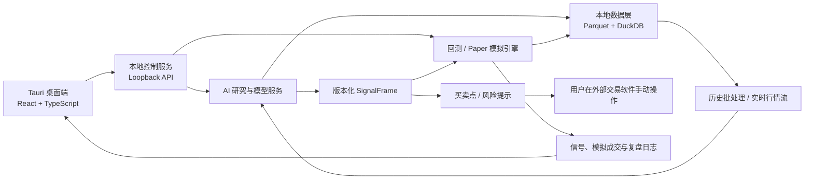

# AstraQuant

面向中国 A 股与国内期货的本地优先、AI 主导量化研究与实时决策辅助平台。

> 当前状态：Phase 3A `IN_PROGRESS`，Phase 3B 首个实时量化与 Paper 切片已完成。桌面端
> 已接通东财掘金真实只读行情、版本化 `baseline-v1` 信号、本地模拟账户、真实行情盯市、
> 虚拟撮合和盈亏核算。尚未完成真实 A 股交易时段的 30 分钟行情验收，也未连接真实交易账户。

## 为什么做 AstraQuant

现有量化项目往往各有所长：有的擅长研究和机器学习，有的擅长实盘执行，有的拥有优秀的数据工作区，却很少同时兼顾 AI 原生研究、国内市场、本地数据隐私、现代桌面体验以及研究到交易的完整闭环。

AstraQuant 不是在传统量化软件末端附加一个聊天机器人，而是让 AI 贯穿研究、特征发现、模型训练、信号生成、市场状态识别和复盘，同时由确定性系统负责数据一致性、回测核算、信号质量与 Paper 模拟。AstraQuant 不连接真实交易账户，用户在外部券商或期货软件中自行下单：

```text
离线循环：历史数据 → 特征工程 → AI 训练 → 回测验证 → 模型发布
在线循环：实时行情 → 在线特征 → AI 推理 → 结构化信号
          → 买卖点/风险提示 → Paper 模拟 → 用户外部手动交易 → 复盘
```

第一阶段不追求每个模块功能齐全，而是先建立边界清晰、可以逐步加深的完整骨架。

## 产品方向

- **本地优先**：行情、因子、策略、回测结果和交易日志默认保存在用户电脑。
- **AI 主导**：AI 是研究、信号与决策辅助的核心能力，不是后期外挂功能。
- **双循环架构**：离线训练和在线推理解耦，通过版本化特征、模型与信号衔接。
- **桌面优先**：使用现代桌面外壳承载 Web 技术界面，优先支持 Windows。
- **国内市场优先**：首先覆盖中国 A 股和国内期货，并为其他市场保留适配边界。
- **渐进执行边界**：当前只做建议和本地模拟成交；未来实盘网关必须独立审批、独立风控并默认关闭。
- **安全优先**：当前平台不保存交易凭据，不向真实账户发送委托。
- **可个性化**：默认界面简约专业，同时支持暗色、终端和原创动漫主题、自定义本地背景。

## 计划架构



## 开源项目研究

AstraQuant 不会将多个大型项目简单拼接，也不会无来源复制代码。当前重点研究：

| 项目 | 主要借鉴方向 | 初步采用策略 |
| --- | --- | --- |
| [vn.py](https://github.com/vnpy/vnpy) | 国内行情语义、事件引擎、数据录制 | 借鉴实时数据与事件架构，不接入实盘交易 |
| [Qlib](https://github.com/microsoft/qlib) | 因子、模型、实验记录、研究工作流 | 可选研究引擎，保持核心解耦 |
| [LEAN](https://github.com/QuantConnect/Lean) | 多资产领域模型和回测生命周期 | 借鉴设计，自主实现边界 |
| [NautilusTrader](https://github.com/nautechsystems/nautilus_trader) | 事件驱动、订单状态机、风控与执行一致性 | 深度研究架构，避免许可证耦合 |
| [OpenBB](https://github.com/OpenBB-finance/OpenBB) | 数据提供者抽象、桌面工作区与产品体验 | 借鉴产品设计，不复制 AGPL 核心 |

详细结论见：

- [开源项目比较](docs/research/open-source-comparison.md)
- [许可证与采用矩阵](docs/research/license-and-adoption-matrix.md)
- [产品设计](docs/superpowers/specs/2026-07-27-astraquant-product-design.md)
- [AI 原生双循环设计](docs/superpowers/specs/2026-07-28-ai-native-quant-design.md)
- [产品路线图](docs/roadmap/product-roadmap.md)
- [AI 原生架构决策](docs/architecture/adr/0003-ai-native-boundaries.md)
- [Git 与多端协作规范](docs/governance/git-workflow.md)
- [本地行情数据运维](docs/operations/local-data.md)
- [东财实时行情连接与验收](docs/operations/eastmoney-market-data.md)
- [实时模拟账户与交易账本](docs/architecture/paper-trading-ledger.md)

## UI 方向

默认提供克制、专业的 `Astra Minimal` 主题，并计划支持：

- `Astra Light`：适合白天研究和长时间阅读。
- `Nebula Boy`：清爽、非成人化的原创动漫少年助手主题。
- `Terminal Pro`：高密度交易终端主题。
- 本地背景、透明度、模糊、字体、圆角和动画强度设置。
- 可拖拽、可停靠、可保存的交易工作区。

主题不得覆盖行情延迟、信号有效期、风险等级和 Paper/真实交易边界等安全语义。

## 数据与隐私

以下内容默认只保存在本机，并被 Git 忽略：

- 行情、Tick、K 线、因子和训练数据。
- SQLite、DuckDB、Parquet 等本地数据文件。
- 数据商账号和访问密钥。
- 回测产物、模型权重、日志和运行缓存。
- 用户自定义背景和私人主题资源。

GitHub 只保存源代码、文档、数据结构定义、迁移脚本、示例配置、主题定义和小型脱敏测试夹具。

## 路线图概览

1. 固化领域模型、数据契约、进程边界和仓库规范。
2. 建立桌面壳、本地服务、主题系统和可观测性基础。
3. 建立 AI 可用的历史数据、实时行情契约、特征快照和数据质量闭环。
4. 打通 AI 特征工程、模型训练、信号生成和可重复回测。
5. 将在线推理接入实时买卖点提醒、Paper 模拟、信号跟踪和复盘（首个纵向切片已完成）。
6. 完成秒级事件总线、策略组合、AI 当日约束、回放和长期稳定性验证。
7. 在充分验证后评估默认关闭、人工授权的独立实盘网关，不让研究模型绕过风控直接下单。

## 风险声明

本项目用于量化研究与软件工程实践，不构成投资建议。交易系统、行情数据和回测结果均可能存在错误；在任何真实资金使用前，必须经过充分测试、模拟运行、人工复核和独立风险评估。

## 当前可运行能力

当前开发版已打通以下本地闭环：

```text
Tauri 桌面 → 随机会话令牌 → 127.0.0.1 FastAPI
→ 独立导入 Worker → 质量校验 → 不可变 Parquet + SQLite 目录
→ DuckDB as-of 查询 → 版本化 FeatureFrame → React 数据中心

东财真实只读行情 → 已完成分钟线 → 在线特征快照
→ baseline 实时策略 → SignalFrame + DecisionRecord
→ 风控 → 本地虚拟撮合 → 持仓/现金/权益 → 桌面审计（不连接交易账户）
```

- Tauri 管理控制服务进程、随机端口、握手和安全关闭。
- FastAPI 仅监听 IPv4 loopback，业务端点统一使用 Bearer 会话认证。
- 实时量化核心在行情非实时、数据过期或分钟样本不足时自动抑制提示。
- 当前 baseline 用于验证数据、决策、审计和界面闭环；AI/ML 模型将在离线评估
  通过后复用同一信号契约进入影子模式。
- 模拟账户可手动录入资金与期初持仓，使用真实最新行情持续盯市；账户、订单、成交、
  持仓和权益快照均保存在本机 SQLite，重启后恢复。
- 策略执行台默认只输出建议。用户明确开启后，`baseline-v1` 才能自动进入本地模拟撮合；
  单标的仓位、现金、A 股 T+1 和同一决策只执行一次等约束始终生效。
- SQLite 保存任务历史和界面设置；异常重启后活动任务标记为 `INTERRUPTED`。
- React 工作区提供总览、数据中心、任务、本地活动、设置和两套基础主题。
- 专业行情图已支持分时累计均价、日/周/月/年 K、MA/BOLL 主图、
  VOL/MACD/KDJ/RSI 副图、十字光标联动和可开关量化信号图层。
- 数据与连接页只展示真实本地行情仓库和质量状态，不再把离线样例导入作为主流程。
- 行情快照与特征快照使用内容寻址 ID；查询同时约束 `event_time` 和
  `available_time`，防止未来信息泄漏。
- 用户自选的代码、顺序和已知名称保存在本地 SQLite，重启后自动恢复；价格和凭据不会
  写入自选记录。
- SDK 路径和 Token 已配置时，桌面启动会自动尝试连接东财行情；终端暂不可用不会阻止
  AstraQuant 启动，用户仍可在终端就绪后手动重试。
- 所有运行数据默认写入仓库根目录的 `.astraquant/`，该目录不会提交 Git。

开发版只保证开发环境运行，不提供安装包。东财实时行情必须由用户本机终端、SDK 和
Token 提供；缺失或休市时界面显示明确空态，不使用假行情。Phase 3A 只有通过
[真实交易时段验收](docs/research/eastmoney-realtime-acceptance.md)后才会标记完成。

## 开发环境

### 前置条件

- Windows 10/11 与 WebView2 Runtime。
- Visual Studio Build Tools，包含 C++ 桌面生成工具。
- Python 3.12。
- [uv](https://docs.astral.sh/uv/)。
- Node.js 24（脚本会通过 Corepack 使用 pnpm 11.9）。
- Rust 1.96（MSVC toolchain）。

日常只需在仓库根目录执行：

```powershell
.\start.ps1
```

脚本会自动进入正确项目目录并准备缺失的项目依赖。首次手工准备依赖时可使用：

```powershell
uv python install 3.12
uv sync --locked --all-packages
pnpm install --frozen-lockfile
```

`start.ps1` 只启动 Tauri；Tauri 会自动拉起并管理本地 FastAPI，因此不需要再开一个
API 终端。自定义状态目录、备份恢复与 AKShare 可选开关见
[本地行情数据运维](docs/operations/local-data.md)。

常用检查：

```powershell
uv run pytest
uv run ruff format --check .
uv run ruff check .
uv run mypy
pnpm --dir apps/desktop test
pnpm --dir apps/desktop check
cargo test --manifest-path apps/desktop/src-tauri/Cargo.toml
```

关闭桌面窗口时，Tauri 会请求本地服务完成受控关闭，并在超时后终止它。开发期间的
数据库、日志和设置位于 `.astraquant/`；删除该目录会清除本机开发状态。
