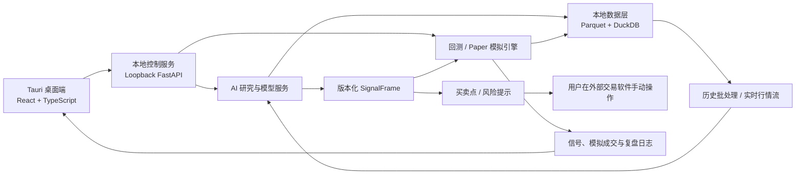

# AstraQuant

> 面向中国 A 股与国内期货的本地优先、AI 主导量化研究与实时决策辅助平台。
> A local-first, AI-native quantitative research and real-time decision support
> platform for China A-shares and domestic futures.

[](LICENSE)

---

## 简介 · About

AstraQuant 是一个**真正能跑起来**的量化研究平台：桌面端已接通真实 A 股/ETF/指数行情，
内置确定性量化引擎与本地模拟账户（Paper Trading），并围绕“研究 → 信号 → 模拟 → 复盘”
建立了完整闭环。它不是传统量化软件末端挂一个 AI 聊天框，而是让 AI 贯穿研究、特征发现、
模型训练、信号生成与复盘，同时由确定性系统负责数据一致性、核算与风险边界。

AstraQuant is an **open, runnable** quantitative research platform for China markets:
real A-share/ETF/index quotes via a desktop app, a deterministic quant engine, and a
local paper-trading ledger, connected end-to-end around
"research → signals → simulation → review".

```text
离线循环 Offline loop：历史数据 → 特征工程 → AI 训练 → 回测验证 → 模型发布
在线循环 Online loop：实时行情 → 在线特征 → AI 推理 → 结构化信号
                    → 买卖点/风险提示 → Paper 模拟 → 外部手动交易 → 复盘
```

---

## 核心亮点 · Highlights

- **真实行情闭环**：桌面端直接连接东财掘金真实只读行情（A 股、ETF、指数、期货），
  非实时/过期/样本不足时自动抑制提示，绝不用假数据降级。
- **AI 主导双循环**：离线训练与在线推理解耦，通过版本化特征、模型与信号衔接，
  同一个信号契约同时服务回测与实时推理。
- **本地优先与隐私**：行情、模型、日志、模拟账户全部保存在用户本机，
  不收集、不上传、不保存任何交易凭据。
- **安全边界明确**：平台不连接真实交易账户、不发送委托；用户明确开启后，
  自动执行也仅限于本地模拟账户，A 股 T+1、仓位与现金约束始终生效。
- **现代桌面体验**：Tauri + React 桌面端，券商式行情工作台：分时/日周月年 K、
  MA/BOLL、VOL/MACD/KDJ/RSI、十字光标联动、量化信号图层、多主题与工作区。
- **可审计**：每个信号都带策略版本、特征版本、原因码、置信度、有效期与决策记录 ID；
  模拟成交与盈亏全部留痕，支持完整复盘。

---

## 当前状态 · Status

| 阶段 | 状态 |
| --- | --- |
| Phase 0 仓库与契约 | ✅ 完成 |
| Phase 1 桌面与本地平台骨架 | ✅ 完成 |
| Phase 2 AI 可用的数据闭环 | ✅ 完成（2026-07-28） |
| Phase 3A 东财国内真实行情 | 🚧 IN_PROGRESS（核心功能已可运行） |
| Phase 3B 实时量化与 Paper 切片 | ✅ 首个纵向切片完成（2026-08-06） |

> 尚未完成：真实 A 股交易时段的 30 分钟行情验收、AI/ML 基线模型训练（Phase 4A）、
> 以及任何形式的真实账户连接。当前开发版只保证开发环境运行，不提供安装包。

---

## 架构 · Architecture



技术栈：Python 3.12 (FastAPI / SQLAlchemy / DuckDB) · Tauri 2 / Rust · React 19 /
TypeScript / Vite · pnpm / uv 双锁文件工作区。

---

## 开源范围 · Open Source Boundary

本仓库采用 **Apache-2.0** 许可证，开放以下核心能力（面向研究、学习与商业评估）：

- 领域契约（标的、信号、订单状态机、版本化事件）
- 本地数据层（Parquet 存储、DuckDB 时点查询、数据质量）
- 实时量化引擎与信号协议（SignalFrame / DecisionRecord）
- Paper 模拟账本（虚拟撮合、费用、持仓、盈亏核算）
- 桌面端与本地服务全栈代码

为保护商业能力，以下内容**不会**进入公开仓库，由用户在本机自行准备：

- 行情数据、模型权重、训练集与运行日志
- 数据商 / 券商凭据与访问密钥
- 用户私人主题与本地背景资源

---

## 快速开始 · Quick Start

### 前置条件 Prerequisites

Windows：

- Windows 10/11 与 WebView2 Runtime
- Visual Studio Build Tools（C++ 桌面生成工具）
- Python 3.12、[uv](https://docs.astral.sh/uv/)、Node.js 24、Rust 1.96（MSVC toolchain）

macOS / Linux：

- macOS 13+（Intel 或 Apple Silicon）、Xcode Command Line Tools
- Python 3.12、[uv](https://docs.astral.sh/uv/)、Node.js 24、Rust 1.96

### 启动 Run

```powershell
# Windows
.\start.ps1
```

```bash
# macOS / Linux
./scripts/dev.sh
```

脚本自动准备缺失依赖并启动 Tauri 桌面端；Tauri 自动拉起并管理本地 FastAPI 服务，
无需另开终端。

### 常用检查 Quality checks

```powershell
uv run pytest
uv run ruff format --check .
uv run ruff check .
uv run mypy
pnpm --dir apps/desktop test
pnpm --dir apps/desktop check
cargo test --manifest-path apps/desktop/src-tauri/Cargo.toml
```

---

## 路线图 · Roadmap

1. ✅ 领域模型、数据契约、进程边界与仓库规范（Phase 0）
2. ✅ 桌面壳、本地服务、主题系统与可观测性（Phase 1）
3. ✅ AI 可用的历史/实时数据契约与数据质量闭环（Phase 2）
4. 🚧 东财真实行情验收与 30 分钟交易时段验证（Phase 3A）
5. ✅ 实时量化与 Paper 纵向切片（Phase 3B）
6. AI 特征工程、模型训练、信号生成与可重复回测（Phase 4A）
7. 实时 AI 信号、事件总线、回放与长期稳定性（Phase 4B）
8. 外部手动交易辅助闭环与复盘（Phase 5）
9. 在充分验证后评估默认关闭、人工授权的独立实盘网关（Phase 6）

完整细节见 [产品路线图](docs/roadmap/product-roadmap.md)。

---

## 数据与隐私 · Privacy

以下内容默认只保存在本机，并被 Git 忽略：

- 行情、Tick、K 线、因子和训练数据
- SQLite / DuckDB / Parquet 等本地数据文件
- 数据商账号和访问密钥
- 回测产物、模型权重、日志与运行缓存

GitHub 只保存源代码、文档、数据结构定义、迁移脚本、示例配置与小型脱敏测试夹具。

---

## 贡献 · Contributing

我们欢迎任何形式的贡献：Issue、文档、测试、功能与体验建议。

- 请先阅读 [Git 与多端协作规范](docs/governance/git-workflow.md)。
- 遵循仓库质量门禁：`ruff` / `mypy` / `pytest` / `tsc` / `vitest` / `cargo test`
  在提交前全部通过。
- 涉及行情数据、凭据或交易安全的变更会经过更严格的审查。
- 所有贡献默认按 Apache-2.0 授权；请勿在提交中夹带私人数据或密钥。

---

## 相关研究 · Research

AstraQuant 不拼接大型项目，也不无来源复制代码。当前重点研究：

| 项目 | 主要借鉴方向 | 初步采用策略 |
| --- | --- | --- |
| [vn.py](https://github.com/vnpy/vnpy) | 国内行情语义、事件引擎、数据录制 | 借鉴实时数据与事件架构，不接入实盘交易 |
| [Qlib](https://github.com/microsoft/qlib) | 因子、模型、实验记录、研究工作流 | 可选研究引擎，保持核心解耦 |
| [LEAN](https://github.com/QuantConnect/Lean) | 多资产领域模型和回测生命周期 | 借鉴设计，自主实现边界 |
| [NautilusTrader](https://github.com/nautechsystems/nautilus_trader) | 事件驱动、订单状态机、风控一致性 | 深度研究架构，避免许可证耦合 |
| [OpenBB](https://github.com/OpenBB-finance/OpenBB) | 数据提供者抽象、桌面工作区体验 | 借鉴产品设计，不复制 AGPL 核心 |

详细结论见 [开源项目比较](docs/research/open-source-comparison.md) 与
[许可证与采用矩阵](docs/research/license-and-adoption-matrix.md)。

---

## License

Apache License 2.0 — 详见 [LICENSE](LICENSE)。

商业使用、修改与再分发均允许；商标、担保与责任条款见许可证原文。

---

## 风险声明 · Disclaimer

本项目用于量化研究与软件工程实践，**不构成投资建议**。交易系统、行情数据和回测结果
均可能存在错误；在任何真实资金使用前，必须经过充分测试、模拟运行、人工复核和独立
风险评估。AstraQuant 不连接真实交易账户，用户在外部券商或期货软件中自行下单。

This project is for research and engineering purposes only and does not
constitute investment advice.
