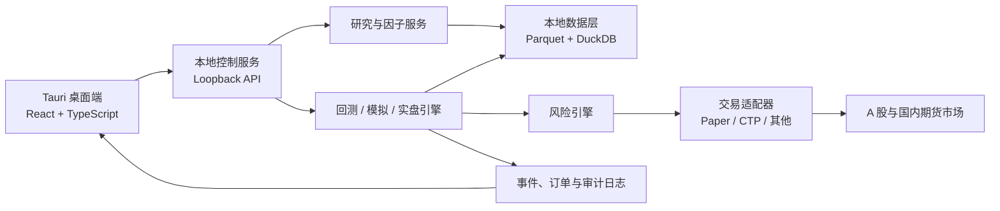

# AstraQuant

面向中国 A 股与国内期货的本地优先量化研究、回测与交易平台。

> 当前状态：Phase 1 桌面开发版已可运行，包含本地服务、SQLite、示例 Worker
> 与任务工作区；尚未接入行情、回测、模拟或实盘交易，请勿用于真实资金交易。

## 为什么做 AstraQuant

现有量化项目往往各有所长：有的擅长研究和机器学习，有的擅长实盘执行，有的拥有优秀的数据工作区，却很少同时兼顾国内市场、本地数据隐私、现代桌面体验以及研究到交易的完整闭环。

AstraQuant 希望将完整流程连接起来：

```text
数据接入 → 数据治理 → 因子与策略研究 → 回测评估
→ 模拟交易 → 风险控制 → 实盘执行 → 监控告警 → 交易复盘
```

第一阶段不追求每个模块功能齐全，而是先建立边界清晰、可以逐步加深的完整骨架。

## 产品方向

- **本地优先**：行情、因子、策略、回测结果和交易日志默认保存在用户电脑。
- **桌面优先**：使用现代桌面外壳承载 Web 技术界面，优先支持 Windows。
- **国内市场优先**：首先覆盖中国 A 股和国内期货，并为其他市场保留适配边界。
- **研究与交易分层**：研究管线负责生成信号，事件驱动交易核心负责回测、模拟和实盘。
- **安全优先**：模拟与实盘严格区分，密钥不进入项目数据库或 Git。
- **可个性化**：默认界面简约专业，同时支持暗色、终端和原创动漫主题、自定义本地背景。

## 计划架构



## 开源项目研究

AstraQuant 不会将多个大型项目简单拼接，也不会无来源复制代码。当前重点研究：

| 项目 | 主要借鉴方向 | 初步采用策略 |
| --- | --- | --- |
| [vn.py](https://github.com/vnpy/vnpy) | 国内交易接口、Gateway、事件引擎、OMS | 适配集成，优先复用国内生态 |
| [Qlib](https://github.com/microsoft/qlib) | 因子、模型、实验记录、研究工作流 | 可选研究引擎，保持核心解耦 |
| [LEAN](https://github.com/QuantConnect/Lean) | 多资产领域模型、回测与实盘生命周期 | 借鉴设计，自主实现边界 |
| [NautilusTrader](https://github.com/nautechsystems/nautilus_trader) | 事件驱动、订单状态机、风控与执行一致性 | 深度研究架构，避免许可证耦合 |
| [OpenBB](https://github.com/OpenBB-finance/OpenBB) | 数据提供者抽象、桌面工作区与产品体验 | 借鉴产品设计，不复制 AGPL 核心 |

详细结论见：

- [开源项目比较](docs/research/open-source-comparison.md)
- [许可证与采用矩阵](docs/research/license-and-adoption-matrix.md)
- [产品设计](docs/superpowers/specs/2026-07-27-astraquant-product-design.md)
- [产品路线图](docs/roadmap/product-roadmap.md)
- [Git 与多端协作规范](docs/governance/git-workflow.md)

## UI 方向

默认提供克制、专业的 `Astra Minimal` 主题，并计划支持：

- `Astra Light`：适合白天研究和长时间阅读。
- `Nebula Boy`：清爽、非成人化的原创动漫少年助手主题。
- `Terminal Pro`：高密度交易终端主题。
- 本地背景、透明度、模糊、字体、圆角和动画强度设置。
- 可拖拽、可停靠、可保存的交易工作区。

主题不得覆盖实盘标识、风险等级、紧急停止和关键订单状态的安全语义。

## 数据与隐私

以下内容默认只保存在本机，并被 Git 忽略：

- 行情、Tick、K 线、因子和训练数据。
- SQLite、DuckDB、Parquet 等本地数据文件。
- 券商、CTP、数据商账号和访问密钥。
- 回测产物、模型权重、日志和运行缓存。
- 用户自定义背景和私人主题资源。

GitHub 只保存源代码、文档、数据结构定义、迁移脚本、示例配置、主题定义和小型脱敏测试夹具。

## 路线图概览

1. 固化领域模型、数据契约、进程边界和仓库规范。
2. 建立桌面壳、本地服务、主题系统和可观测性基础。
3. 打通公开数据导入、查询、研究和可重复回测。
4. 打通 Paper Trading、订单状态、基础风控和交易复盘。
5. 通过适配层接入国内期货 CTP，再评估 A 股实盘通道。
6. 增加因子实验、模型训练、策略组合和远程私有节点。

## 风险声明

本项目用于量化研究与软件工程实践，不构成投资建议。交易系统、行情数据和回测结果均可能存在错误；在任何真实资金使用前，必须经过充分测试、模拟运行、人工复核和独立风险评估。

## Phase 1 可运行能力

当前开发版已打通以下本地闭环：

```text
Tauri 桌面 → 随机会话令牌 → 127.0.0.1 FastAPI
→ SQLite 任务状态 → 独立 Worker → 进度/取消/结果 → React 工作区
```

- Tauri 管理控制服务进程、随机端口、握手和安全关闭。
- FastAPI 仅监听 IPv4 loopback，业务端点统一使用 Bearer 会话认证。
- SQLite 保存任务历史和界面设置；异常重启后活动任务标记为 `INTERRUPTED`。
- React 工作区提供总览、任务、本地活动、设置和两套基础主题。
- 所有运行数据默认写入仓库根目录的 `.astraquant/`，该目录不会提交 Git。

Phase 1 只保证开发环境运行，不提供安装包。

## 开发环境

### 前置条件

- Windows 10/11 与 WebView2 Runtime。
- Visual Studio Build Tools，包含 C++ 桌面生成工具。
- Python 3.12。
- [uv](https://docs.astral.sh/uv/)。
- Node.js 24 与 pnpm 11.9。
- Rust 1.96（MSVC toolchain）。

首次准备：

```powershell
uv python install 3.12
uv sync --locked --all-packages
pnpm install --frozen-lockfile
```

启动桌面开发版：

```powershell
pnpm dev
```

常用检查：

```powershell
uv run pytest
uv run ruff format --check .
uv run ruff check .
uv run mypy
pnpm --dir apps/desktop test
pnpm --dir apps/desktop check
cargo test --manifest-path apps/desktop/src-tauri/Cargo.toml
```

关闭桌面窗口时，Tauri 会请求本地服务完成受控关闭，并在超时后终止它。开发期间的
数据库、日志和设置位于 `.astraquant/`；删除该目录会清除本机开发状态。
