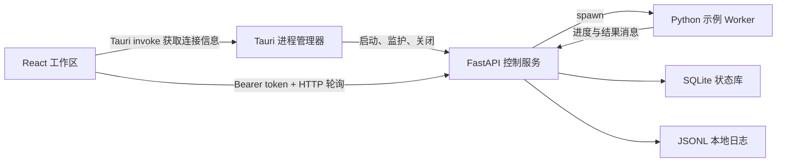

# AstraQuant Phase 1 桌面与本地平台设计

日期：2026-07-27
状态：已批准

## 1. 目标

Phase 1 建立一个可在开发环境运行的 Windows 优先桌面纵向切片。用户启动 Tauri
桌面端后，应用自动启动只监听 loopback 的 Python 控制服务；用户可以创建一个真实
示例任务、观察进度、取消任务、查看持久化历史，并在退出桌面时安全关闭 Worker 和
控制服务。

本阶段为后续数据、研究、回测、模拟和实盘功能提供稳定的平台边界，不实现任何真实
行情、策略、交易或资金功能。

## 2. 成功标准

Phase 1 完成时必须满足：

1. 开发者可以用一个根级命令启动 Tauri、React 和 Python 控制服务。
2. Tauri 生成短期会话令牌，启动 Python 子进程并完成版本化就绪握手。
3. React 能展示控制服务、Worker、数据库和日志状态。
4. 用户能创建一个独立 Worker 进程执行的示例自检任务。
5. UI 能展示任务进度、当前步骤、结果和带关联 ID 的活动记录。
6. 用户能请求取消运行中的任务，并看到确定的终态。
7. 任务与设置写入本地 SQLite；应用重启后仍能查询历史。
8. 上次异常退出遗留的活动任务在启动恢复时被标记为 `INTERRUPTED`。
9. 正常退出会停止接受新任务、取消活动任务并关闭服务；超时后由 Tauri 终止子进程。
10. `Astra Minimal` 和 `Astra Light` 可切换，选择结果在本机持久化。
11. Python、TypeScript 和 Rust 的相关检查在 CI 中通过。
12. 私人设置、SQLite、日志和浏览器设计草图不进入 Git。

## 3. 范围

### 3.1 本阶段包含

- Tauri v2 桌面外壳和 Rust 进程管理。
- React + TypeScript 工作区。
- FastAPI 本地控制服务。
- 独立 Python Worker 示例任务。
- SQLite 迁移、任务历史和设置。
- 本地 JSONL 结构化日志。
- 两个基础主题和统一设计令牌。
- 总览、任务中心、本地日志和设置页面。
- Python、前端、Rust 和进程边界测试。

### 3.2 本阶段不包含

- Windows 安装包、签名、自动升级和便携版。
- A 股或期货行情接入。
- Parquet、DuckDB、交易日历和数据质量报告。
- 策略、回测、Paper Trading 或实盘交易。
- 远程访问、多用户、云同步或移动端。
- 可拖拽停靠布局。
- 自定义动漫素材包和 `Nebula Boy` 完整主题。

数据闭环属于 Phase 2；桌面打包在主要功能稳定后单独设计。

## 4. 方案选择

### 4.1 采用：真实纵向切片

桌面、控制服务、Worker、SQLite 和 UI 通过真实协议连接。这样能尽早暴露 Windows
子进程、端口、退出和重启恢复问题，也能让后续业务直接复用已验证的生命周期。

### 4.2 未采用：后端优先

先完成 API 和任务系统、以后再接桌面，单元测试较简单，但会推迟最关键的桌面进程
边界验证。

### 4.3 未采用：UI 原型优先

先用模拟数据完成界面能较快看到视觉效果，但会积累模拟状态和临时接口，接入真实服务
时容易返工。

## 5. 总体架构



模块边界：

```text
apps/desktop/                   Tauri v2 + React + TypeScript
  src/                          UI、查询、主题和页面
  src-tauri/                    Rust 子进程与窗口生命周期
packages/api/                   FastAPI、任务编排、SQLite 和日志
packages/domain/                Phase 0 稳定领域契约
tests/                          Python 仓库级与跨边界测试
```

`astraquant-domain` 不依赖桌面、HTTP 或数据库。`astraquant-api` 可以依赖领域包；
桌面端只依赖版本化 HTTP 和 Tauri 命令，不导入 Python 内部实现。

## 6. 桌面进程生命周期

### 6.1 启动

1. Tauri 生成至少 256 位随机会话令牌。
2. Tauri 以子进程启动控制服务，通过环境变量传入令牌和本地状态目录。
3. 控制服务绑定 `127.0.0.1:0`，由操作系统选择空闲端口。
4. 完成迁移与恢复后，服务向标准输出写入一行就绪消息：

```json
{"type":"ready","protocol_version":1,"host":"127.0.0.1","port":43127,"pid":12040}
```

5. Tauri 校验消息类型、协议版本、host、port 和实际子进程 PID。
6. React 通过 Tauri 命令获取只在当前窗口会话有效的连接信息。
7. UI 成功调用 `/health` 后进入工作区；超时或握手失败进入可重试错误页。

控制服务在就绪消息前写出的日志必须进入 `stderr`，避免污染机器可读的 `stdout`
握手通道。

### 6.2 运行

Tauri 持有控制服务子进程句柄并监听退出事件。React 不直接创建或终止操作系统进程。
控制服务退出后，UI 显示离线状态并提供重新启动操作。

### 6.3 正常退出

1. Tauri 拦截窗口关闭事件并阻止立即退出。
2. UI 停止创建新任务。
3. Tauri 调用受令牌保护的内部关闭端点。
4. 控制服务把活动任务置为 `CANCEL_REQUESTED`，等待 Worker 在宽限期内退出。
5. 服务刷写任务状态与日志后退出。
6. 若超过宽限期，Tauri 终止控制服务进程；下次启动通过恢复规则处理残留状态。
7. 子进程确认退出后关闭桌面窗口。

Phase 1 默认宽限期为 5 秒，并允许在开发配置中覆盖。

## 7. 本地 API

所有 `/v1` 和 `/internal` 端点要求：

```http
Authorization: Bearer <session-token>
```

公开端点只有不返回私人状态的 `GET /health`。

| 方法 | 路径 | 用途 |
|---|---|---|
| `GET` | `/health` | 进程存活和协议版本 |
| `GET` | `/v1/runtime` | Worker、数据库、日志与关闭状态 |
| `GET` | `/v1/tasks` | 按创建时间倒序列出任务 |
| `POST` | `/v1/tasks/demo` | 创建示例自检任务 |
| `GET` | `/v1/tasks/{task_id}` | 查询任务、进度和结果 |
| `POST` | `/v1/tasks/{task_id}/cancel` | 幂等请求取消 |
| `GET` | `/v1/activity` | 查询最近结构化活动 |
| `GET` | `/v1/settings` | 读取本地 UI 设置 |
| `PATCH` | `/v1/settings` | 校验并更新本地 UI 设置 |
| `POST` | `/internal/shutdown` | 进入受控关闭流程 |

UI 使用 TanStack Query 短轮询：有活动任务时每 500 毫秒查询任务，无活动任务时每
3 秒查询运行状态。Phase 1 不引入 WebSocket 或 SSE。

## 8. 任务模型与 Worker

任务状态：

```text
PENDING
RUNNING
CANCEL_REQUESTED
SUCCEEDED
FAILED
CANCELED
INTERRUPTED
```

合法转换：

```text
PENDING -> RUNNING | CANCELED | INTERRUPTED
RUNNING -> CANCEL_REQUESTED | SUCCEEDED | FAILED | INTERRUPTED
CANCEL_REQUESTED -> CANCELED | SUCCEEDED | FAILED | INTERRUPTED
```

终态不能再次转换。对终态重复取消返回当前任务，不产生新事件。

每个任务至少包含：

- `task_id`
- `task_type`
- `status`
- `progress`，范围 0 到 100
- `current_step`
- `correlation_id`
- `worker_pid`
- `created_at`、`started_at`、`finished_at`
- `result_json`
- `error_code` 和 `error_message`
- `revision`，用于拒绝过期更新

示例任务类型为 `demo.self_check`。Worker 依次报告六个确定步骤，并在步骤之间检查
取消信号。它不访问网络、不读取市场数据，也不模拟交易收益。

控制服务使用 `multiprocessing` 的 `spawn` 启动方式，确保 Windows 与生产语义一致。
Worker 通过受限消息队列发送进度、成功、失败和取消确认；它不直接写 SQLite。

## 9. SQLite 与恢复

SQLite 文件位于：

```text
.astraquant/state/astraquant.sqlite3
```

使用 SQLAlchemy 2 管理访问，Alembic 管理前向迁移。首版表：

- `tasks`：任务当前快照。
- `task_events`：任务状态与进度的追加式历史。
- `settings`：经过 Schema 校验的本地设置。
- `alembic_version`：迁移版本。

服务启动并取得单实例锁后，在接受请求前执行：

1. 运行迁移。
2. 将 `PENDING`、`RUNNING` 和 `CANCEL_REQUESTED` 任务统一转换为
   `INTERRUPTED`。
3. 为每个转换写入 `task_events`，原因为 `service_restarted`。
4. 完成后发布就绪握手。

SQLite 启用 WAL、foreign keys 和 busy timeout。Phase 1 只有控制服务写数据库，
Worker 与 React 均不直接打开数据库。

## 10. 日志与可观测性

日志目录：

```text
.astraquant/logs/
```

控制服务按天写 JSONL。每条记录包含 UTC 时间、级别、组件、事件名、`correlation_id`、
`task_id` 和经过脱敏的字段。会话令牌、环境变量、请求认证头和未来凭据永远不写日志。

UI 的“本地日志”页只读取 API 返回的最近结构化活动，不直接加载任意日志文件。用户可
通过 Tauri 命令打开日志目录。

## 11. UI 与主题

### 11.1 信息架构

Phase 1 提供：

- 总览：运行健康、活动 Worker、今日任务、状态库大小、当前任务和最近活动。
- 任务中心：任务历史、状态筛选、详情和取消操作。
- 本地日志：最近活动、关联 ID 和打开日志目录。
- 设置：主题、减少动画、背景效果和开发诊断。

数据中心、研究中心和交易中心以禁用的未来入口展示，明确产品方向但不包含伪功能。

### 11.2 视觉方向

默认 `Astra Minimal` 使用深墨色背景、低饱和青色强调和紧凑但不拥挤的信息密度。
`Astra Light` 使用相同空间与语义令牌，只改变表面和文本色。

主题令牌分为：

- 普通视觉令牌：表面、文字、边框、阴影、圆角、模糊、动画和图表色板。
- 安全语义令牌：实盘、模拟、风险、买、卖、警告、错误和紧急停止。

普通主题不能覆盖安全语义令牌。Phase 1 预留本地背景和角色资源层，但不提交版权不明
素材，也不实现完整 `Nebula Boy` 主题。

本阶段采用固定响应式工作区，不实现拖拽停靠。侧栏折叠状态、主题和减少动画设置保存
到 SQLite。

## 12. 错误处理

- 握手超时：显示启动失败页，包含重试和打开本地日志目录操作。
- 协议版本不匹配：拒绝连接，展示桌面端与服务端版本。
- API 离线：保留最后一次只读画面并标记为过期，不允许创建或取消任务。
- 重复创建：客户端生成 `Idempotency-Key`，控制服务返回同一任务。
- 重复取消：返回当前任务状态。
- Worker 异常退出：任务转为 `FAILED`，记录稳定错误码和本地技术详情。
- 服务异常退出：Tauri 显示离线并允许重新启动；恢复时遗留任务转为 `INTERRUPTED`。
- SQLite 迁移失败：服务不发布就绪消息，不尝试带旧 Schema 继续运行。
- 正常关闭超时：Tauri 终止子进程，下次启动由恢复流程修正状态。

用户界面展示可操作说明；堆栈和底层异常只写入脱敏本地日志。

## 13. 安全与隐私

- API 只绑定 `127.0.0.1`，不接受局域网或公网监听配置。
- 每次桌面启动生成新令牌，令牌不写磁盘。
- React 只能通过受控 Tauri 命令取得当前会话连接信息。
- CORS 只允许 Tauri/WebView 开发与运行来源。
- 内部关闭端点与业务端点使用同一会话认证。
- 日志、SQLite、设置和未来自定义背景均受仓库策略阻止。
- Phase 1 不接触交易凭据。

## 14. 测试策略

### 14.1 Python

- 任务状态转换和终态不变量单元测试。
- 临时 SQLite 上的迁移、持久化和重启恢复测试。
- FastAPI 认证、幂等创建、查询和取消接口测试。
- `spawn` Worker 的进度、成功、取消和异常退出集成测试。
- 日志脱敏测试。

### 14.2 TypeScript

- 运行状态、任务进度和离线状态组件测试。
- TanStack Query 轮询与取消交互测试。
- 主题切换、设置持久化和安全语义令牌测试。
- React 页面无障碍基础检查。

### 14.3 Rust

- 就绪 JSON 解析和协议版本校验单元测试。
- 非 loopback host、无效端口和 PID 不匹配拒绝测试。
- 正常关闭、超时终止和意外退出状态测试。

### 14.4 跨边界

- 启动服务、取得健康状态、创建任务、观察完成、重启后查询历史。
- 创建长任务、请求取消、确认 `CANCELED`。
- 模拟服务崩溃，重启后确认任务为 `INTERRUPTED`。
- Windows 为桌面闭环主验证平台；Python 和前端纯逻辑继续在 Windows、Ubuntu CI
  运行。

## 15. 开发与 Git 边界

Phase 1 增加 Node 和 Rust 锁文件、数据库迁移、主题令牌和测试，它们必须提交。
以下内容不得提交：

```text
.astraquant/
.superpowers/
apps/desktop/node_modules/
apps/desktop/dist/
apps/desktop/src-tauri/target/
*.sqlite*
*.jsonl
```

根级开发命令应负责安装或检查依赖并并行启动桌面与本地服务。Phase 1 不承诺用户级
安装体验，只保证仓库文档描述的开发环境可以重复启动。

## 16. 交付顺序

1. 扩展 Monorepo 的 Node、Rust 和 Python 工具链。
2. 实现 SQLite 迁移、任务仓库和恢复规则。
3. 实现 Worker 生命周期和示例任务。
4. 实现 FastAPI 认证与端点。
5. 实现 Tauri 子进程握手和关闭。
6. 实现 React 工作区、任务页面和设置。
7. 接通完整桌面闭环并补齐 CI、文档和故障测试。

每一步使用独立提交和相关测试。功能分支推送后创建 Draft PR；在双平台检查和 Windows
桌面检查通过前不合并 `main`。
