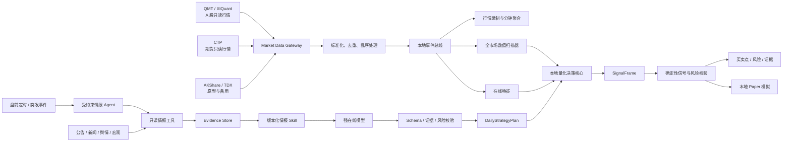

# AstraQuant 实时行情与 AI 情报底座设计

日期：2026-07-28
状态：已获用户确认

## 1. 目标与用户场景

AstraQuant 的首要用户场景不再是“用户导入一份历史文件后分析”，而是：

1. 用户启动桌面程序，程序自动连接用户已配置的只读行情源。
2. 首页展示 A 股全市场、主要指数、板块、数据源健康度和候选股票。
3. 本地数值扫描器持续处理全市场行情，形成候选池和盘中状态。
4. 在线 AI 收集带来源和时间的公告、新闻、舆情与宏观信息，生成结构化的当日策略计划。
5. 用户选择股票后，看到分时行情、AI 当日观点、量化买卖点、风险、失效条件和证据。
6. 用户可以把信号送入本地虚拟盘，观察虚拟成交、持仓、盈亏和策略统计。
7. 真实交易始终由用户在外部券商或期货软件中手工完成。

历史导入、样例数据和行情回放继续保留，但它们是研究、测试和故障诊断工具，不再是产品主入口。

## 2. 方案比较与选择

### 方案 A：先完成历史回测，再接实时行情

优点是传统研究路径完整。缺点是短期内仍不能满足用户打开软件就看到全市场和盘中买卖点的核心体验，也无法尽早验证国内行情权限、延迟和断线恢复。暂不采用。

### 方案 B：直接把网页行情和在线大模型接到界面

优点是演示速度快。缺点是网页快照缺少稳定性和服务保证，大模型输出无法直接承担 Tick 级计算、风控和虚拟撮合，后续必然重构。拒绝。

### 方案 C：先建立可替换的实时行情底座，再并行推进策略验证

首先完成只读行情 Provider、全市场流、录制回放、在线特征和健康监控；同时保留现有历史快照能力，为策略回测提供同一套时态语义。在线 AI 只产生结构化当日策略计划，本地量化核心根据实时行情确定买卖点。采用此方案。

## 3. 总体架构



系统分为三层：

- **行情与事实层**：获取、标准化、记录实时市场数据和外部事件，不做投资判断。
- **AI 情报层**：理解公告、新闻、舆情和市场环境，输出有证据、有有效期的当日策略计划。
- **量化决策层**：消费实时数值特征和当日策略计划，通过已验证策略产生具体买卖点。

大语言模型不处理每一个 Tick，也不直接修改虚拟持仓。全市场筛选、行情时效判断、风控和虚拟撮合保持本地确定性。

## 4. 数据源策略

### 4.1 A 股

首选 QMT/MiniQMT 的 XtQuant 只读行情接口：

- 支持沪深全市场最新快照和增量订阅；
- 支持 Tick、分钟线、历史数据和证券信息；
- 行情能力取决于用户自己的 QMT 账户及权限；
- AstraQuant 不启用交易接口，也不保存交易凭据。

AKShare 用于历史、基本面和开发期快照。TDX 社区接口仅用于个人研究原型或临时备用，不承诺生产稳定性，也不将第三方数据打包或再分发。

### 4.2 国内期货

使用 CTP 行情通道获取实时行情，借鉴 vn.py 的 Gateway 和事件驱动边界。只加载行情能力，不注册下单、撤单、资金或持仓查询能力。CTP 不提供的历史数据由本地录制、用户授权的数据商或历史 Provider 补充。

### 4.3 Provider 能力协商

每个 Provider 显式声明能力，调用方不得假设所有数据源相同：

```text
ProviderCapabilities
├─ full_market_snapshot
├─ full_market_stream
├─ instrument_stream
├─ tick_history
├─ bar_history
├─ market_depth_levels
├─ announcements
└─ reference_data
```

Provider 还必须报告：

- 连接状态和最近事件时间；
- 接收延迟和行情陈旧时间；
- 重连次数、丢弃事件数和解析错误数；
- 当前权限和能力缺失原因；
- 数据源标识、适配器版本和会话 ID。

## 5. 实时行情契约

现有 `Tick` 和 `Bar` 契约继续保留，但实时链路需要补充：

- `source_id`、`source_session_id` 和可选源序号；
- `received_time`，区分交易所事件时间和本机接收时间；
- 买一至卖五等可选盘口快照；
- 累计成交量、成交额、涨跌停价格和交易状态；
- 原始标的代码与标准化 `InstrumentId` 的映射证据；
- 数据质量标记，例如 `DELAYED`、`GAP_DETECTED`、`OUT_OF_ORDER`。

所有时间均使用带时区的时间戳。进入策略前必须完成去重、乱序处理、交易日映射和时效检查。过期或来源异常的行情可以展示，但不得触发新的买卖信号。

## 6. 在线 AI 情报 Agent 与 Skill

### 6.1 实现决策

AI 情报层采用“轻量受约束 Agent + 版本化 Skill”，二者不是替代关系：

- **在线模型**负责阅读、推理、归纳、市场环境和情绪判断；
- **Agent Runtime**负责触发、只读工具调用、步骤编排、重试和单次任务上下文；
- **Skill**负责规定分析流程、来源优先级、输出 Schema、校验标准和禁止行为；
- **Evidence Store**保存去重后的证据、时间、来源、内容哈希和关联标的；
- **Output Validator**拒绝无效 Schema、无证据结论、过期计划和越权输出；
- **本地量化核心**根据实时行情、已验证策略和计划约束计算具体买卖点。

不直接把 Codex CLI、OpenCode CLI 或其他通用编码 Agent 嵌入桌面程序作为生产运行底座。它们的代码、文件和终端能力范围大于情报任务需要，也没有天然形成 AstraQuant 的证据、时效与金融审计边界。项目可以借鉴其上下文压缩、工具调用和 Skill 机制，但产品运行时使用面向情报任务的窄接口。

第一版只实现单 Agent 工作流。它可以在发布前运行一个确定性的规则审查和一次模型反方审查，但不引入多个可自由对话的 Agent。只有单 Agent 在准确率、延迟或上下文隔离上出现可测量瓶颈后，才评估拆分收集、分析和审查角色。

### 6.2 Agent 权限

情报 Agent 只拥有：

- 官方公告、授权新闻、宏观数据和低权重舆情的只读查询；
- 本地候选池、指数、板块和截止到决策时刻的只读行情摘要；
- Evidence Store 的受控写入；
- `DailyStrategyPlan` 草案提交。

情报 Agent 不得：

- 读取或要求真实交易凭据；
- 调用真实或虚拟委托接口；
- 修改行情、证据、策略模型或历史计划；
- 自行发布未通过 Validator 的计划；
- 对全市场逐 Tick 调用在线模型；
- 通过网页正文扩大工具权限或改变系统规则。

### 6.3 EvidenceItem

在线 AI 的输入不是未经整理的网页文本，而是经过来源适配器处理的 `EvidenceItem`：

```text
evidence_id
source_type
source_url / announcement_id
publisher
published_at
received_at
related_instruments
content_hash
normalized_summary
trust_level
```

处理顺序为：

1. 优先接收交易所公告、公司公告和权威宏观来源。
2. 新闻数据按来源、发布时间和重复内容去重。
3. 社交舆情只作为低权重辅助证据。
4. 外部文本按不可信输入处理，不能通过正文改变系统指令或工具权限。
5. AI 输出必须引用 `evidence_id`，无证据的结论降低可信度或拒绝发布。

### 6.4 Daily Market Intelligence Skill

第一版提供一个主 Skill：`daily-market-intelligence`。它是版本化工作流定义，不包含账户凭据和新闻全文：

```text
daily-market-intelligence
├─ 确认交易日、市场范围和分析截止时间
├─ 获取指数、板块和宏观环境
├─ 获取交易所与公司公告
├─ 获取新闻和低权重舆情
├─ 去重并建立 EvidenceItem
├─ 读取本地扫描器产生的候选池
├─ 分析候选标的与 MarketRegime
├─ 生成 DailyStrategyPlan 草案
├─ 执行反方审查
└─ 通过 Schema、证据和有效期校验后发布
```

Skill 必须记录 `skill_id`、`skill_version`、输入 Schema、输出 Schema、来源策略、提示模板版本、最大工具调用次数和超时。相同证据快照、模型版本与 Skill 版本能够重放分析过程；由于在线模型可能非确定，重放要求保留原始结构化输出和校验结果，而不承诺重新生成完全相同的文字。

后续可以独立增加：

- `breaking-news-reassessment`：重大消息发生后修订当日计划；
- `symbol-deep-research`：用户选择单只股票后的深度分析；
- `post-market-review`：盘后复盘情报判断、信号和虚拟收益；
- `strategy-plan-critic`：检查证据不足、逻辑冲突和过度自信。

这些 Skill 共享 `EvidenceItem` 和 `DailyStrategyPlan` 契约，但不得互相覆盖历史版本。

### 6.5 DailyStrategyPlan

在线模型通过 Skill 生成 `DailyStrategyPlan`，而不是直接生成买卖委托：

```text
plan_id
plan_version
skill_id / skill_version
instrument_id / market_scope
created_at
valid_from / valid_until
market_regime
catalysts[]
sentiment_score
confidence
candidate_score
allowed_strategy_families[]
strategy_weights
risk_budget
preferred_direction
no_trade_conditions[]
invalidation_conditions[]
evidence_ids[]
model_provider / model_name / prompt_version
```

计划在开盘前生成，在重大公告或市场状态显著变化时可以修订。每次修订创建新版本，旧版本不覆盖，量化决策记录必须指向当时实际使用的版本。

### 6.6 校验与降级

Validator 至少执行：

- 严格 Schema 和枚举校验；
- `valid_from`、`valid_until` 与交易日校验；
- `evidence_ids` 存在性、发布时间和决策时点校验；
- 计划标的与证据关联检查；
- 置信度、风险预算和策略权重范围检查；
- 禁止出现委托指令、账户操作或绕过风控的内容。

Agent、模型或任一情报工具不可用时，本地行情、扫描器和量化核心继续运行。系统可以使用仍在有效期内的已发布计划；没有有效计划时进入 `NO_AI_PLAN`，量化核心只能运行明确允许无 AI 计划的策略，不伪造当日观点。

## 7. 本地量化决策核心

“最先进策略”不等于从社区复制一段近期收益高的代码。策略必须进入统一注册、验证和组合流程：

- 市场状态识别；
- 横截面候选排序；
- 分钟级动量、反转、量价和波动特征；
- 在行情权限允许时使用盘口与订单流特征；
- 监督学习或时序模型；
- 多策略集成与状态路由；
- 组合暴露、止损、冷却时间和信号限频。

每个策略版本必须记录适用市场、频率、特征 Schema、训练区间、验证结果、费用与滑点假设。未经样本外和走步验证的策略不得进入实时提示或 Paper 模拟。

量化核心消费：

```text
DailyStrategyPlan
+ 实时 Tick / 完成的分钟 Bar
+ 在线 FeatureFrame
+ 大盘、板块与候选池状态
+ 当前 Paper 资金与持仓
= SignalFrame
```

`DailyStrategyPlan` 可以调整允许使用的策略、权重和风险预算，但不能绕过行情时效、最大暴露、止损、限频和信号有效期校验。

## 8. 桌面体验调整

现有桌面壳、主题令牌、任务中心和数据中心继续复用。工作区逐步调整为：

- **市场总览**：指数、板块、涨跌分布、候选股和数据源健康度；
- **标的详情**：分时图、量价、买卖点、AI 当日计划、证据和失效条件；
- **候选与自选**：本地扫描排名、AI 评分、触发原因和观察状态；
- **Paper 中心**：虚拟委托、成交、持仓、资金曲线和信号归因；
- **策略实验室**：策略版本、回测、走步验证和模型发布；
- **数据与连接**：QMT/CTP/备用 Provider 配置、录制回放、质量和延迟。

现有“导入示例数据”保留在数据与连接页的开发工具区域，不再占据主要用户流程。

### 8.1 Agent 渐进式透明

Agent 工作过程采用用户选定的“渐进式透明”体验。界面不直播模型思维链，也不默认滚动原始工具日志，而是显示可验证的工作状态：

- 当前阶段：市场环境、证据收集、去重、候选分析、反方审查、计划校验或已发布；
- 原始信息数、去重后证据数、候选标的数和失败来源数；
- 证据截止时间、最近进展时间、计划版本、Skill 版本和模型标识；
- 当前置信度、主要争议、风险与计划无法发布的具体原因；
- 重大事件触发的计划修订和新旧版本差异。

默认视图使用一条清晰的阶段时间线，保持行情工作区可读。用户主动进入“证据室”后，可以查看：

- 按官方公告、权威新闻、普通新闻和舆情分层的证据卡片；
- 每条证据的来源、发布时间、接收时间、关联标的和可信等级；
- 支持当前判断与反对当前判断的证据；
- Agent 调用了哪些只读工具、每一步的结果状态和耗时；
- Validator 接受、警告或拒绝了哪些计划字段。

证据室不展示模型私有思维链。它展示的是输入证据、结构化中间产物、工具轨迹、反方结论和校验结果。

用户可以收藏证据、标记来源质量、添加私人笔记或请求重新分析。用户反馈不会静默修改已发布计划；重新分析必须生成新的 `DailyStrategyPlan` 版本，并在版本差异中标明用户反馈的影响。

视觉表现可以使用柔和的阶段流光、完成脉冲、事件连线和角色助手状态。常规工具调用不弹出动画；只有计划发布、重大突发事件、数据源断开和信号失效使用强提醒。系统遵循“减少动态效果”设置，安全颜色和风险信息不能被主题覆盖。

## 9. 故障与降级

- 主行情源断开：立即将市场状态标为 `STALE`，暂停新信号并重连。
- 备用源可用：仅在能力与时间语义兼容时切换，并显式记录 `source_changed`。
- 行情乱序或缺口：记录质量事件；分钟聚合器在窗口结束和宽限期后封口。
- 在线 AI 不可用：继续展示行情和本地数值扫描；沿用仍在有效期内的计划或进入 `NO_AI_PLAN`，不伪造观点。
- 新闻源异常：降低相应证据可信度，不影响本地行情处理。
- 本地量化模型不可用：停止相应策略信号，不自动启用未批准模型。
- 电脑休眠或进程重启：恢复后重新订阅，不把断档期间的旧行情当作实时事件。

## 10. 测试与验收

第一个实时纵向切片必须证明：

1. 在真实交易时段接收 A 股全市场只读行情，并显示 Provider 健康状态。
2. 正确测量事件时间、接收时间和处理延迟。
3. 断线后可以重连，重复事件不会形成重复分钟成交量或重复信号。
4. Tick 能聚合为一分钟 Bar，并写入本地录制目录。
5. 录制数据能够确定性回放，回放结果与在线聚合结果一致。
6. 本地扫描器能从全市场生成候选池，不调用大语言模型处理每个 Tick。
7. 固定 `EvidenceItem`、模型与 Skill 版本可以重放一次 Agent 工作流并保留原始结构化输出。
8. 一个带固定证据的 `DailyStrategyPlan` 能与实时特征共同形成可追溯 `SignalFrame`。
9. 无证据、过期、Schema 无效或包含越权指令的计划无法发布。
10. 信号只进入 UI 和 Paper 模拟，代码中不存在真实交易出口。
11. 默认界面只展示阶段和证据摘要，证据室能够追溯来源、工具轨迹、反方结论和 Validator 结果。
12. 用户请求重新分析会创建新计划版本，不会覆盖当时已经发布的计划。

若开发阶段没有 QMT 权限，允许先用确定性回放 Provider 和研究型 TDX/AKShare Provider 完成接口验证，但不得把该结果描述为生产级实时行情验收。

## 11. 对现有代码和计划的处理

### 保留

- Tauri + React 桌面壳和根目录 `start.ps1`；
- Loopback FastAPI、任务系统、SQLite 迁移和日志；
- `InstrumentId`、`Tick`、`Bar`、`FeatureFrame` 和时态约束；
- Parquet、DuckDB、不可变快照和数据质量报告；
- 主题系统、设置页和本地数据隐私策略；
- 离线样例与 AKShare 适配器的测试价值。

### 修改

- 扩展流式 Provider 与实时行情字段；
- 将数据中心改造成数据与连接中心；
- 将产品首页改造成实时市场总览；
- 在原 Phase 3 前插入实时行情可行性验证和录制回放；
- 将在线消息/情绪 AI 与低延迟量化推理解耦；
- 将 `DailyStrategyPlan` 加入领域契约和审计链。

### 暂不删除

当前没有发现需要整体回退的实现。任何删除必须由新测试证明旧实现与实时主路径冲突后再进行，避免丢失已经通过验证的数据基础设施。

## 12. 实施阶段与 Git 边界

### Phase 3A：实时行情可行性验证

Provider 能力、QMT 只读适配器、健康指标、全市场接收测试和可行性报告。

### Phase 3B：录制、聚合与确定性回放

Tick 录制、一分钟聚合、缺口处理、回放 Provider 和在线/回放一致性测试。

### Phase 3C：全市场扫描与实时工作区

指数/板块/候选池、本地扫描器、市场总览和标的分时详情。

### Phase 4A：策略研究与验证

策略注册、特征、走步验证、回测、成本模型、模型登记和发布门槛。

### Phase 4B：受约束 Agent、情报 Skill 与结构化计划

Evidence Store、只读工具、单 Agent Runtime、`daily-market-intelligence` Skill、在线模型适配器、Validator 和 `DailyStrategyPlan`。通用编码 Agent CLI 不进入产品运行时。

### Phase 5：实时信号与 Paper 闭环

在线特征、策略组合、`SignalFrame`、确定性风控、虚拟撮合、收益统计和复盘。

每个阶段使用独立功能分支和 Draft PR。只有下列内容自动提交 GitHub：

- 源代码、测试、Schema、迁移和适配器；
- 脱敏的小型确定性夹具；
- 配置模板、文档、测试结果摘要和 CI；
- 不含数据商内容的 UI 资源与原创主题资源。

以下内容永不自动提交：

- 用户行情、Tick、K 线和录制文件；
- QMT、CTP、数据商或在线模型凭据；
- 新闻全文、付费数据和第三方再分发内容；
- 模型权重、用户交易记录、数据库、日志和本地背景。

阶段提交只在对应测试通过后创建；推送到功能分支并更新 Draft PR，不自动合并 `main`。

## 13. 资料依据

- XtQuant `xtdata` 数据接口：<https://dict.thinktrader.net/nativeApi/xtdata.html>
- XtQuant 全推行情说明：<https://dict.thinktrader.net/innerApi/question_answer.html>
- vn.py Gateway 文档：<https://www.vnpy.com/docs/cn/community/info/gateway.html>
- AKShare 股票数据文档：<https://akshare.akfamily.xyz/data/stock/stock.html>
- Tushare 数据权限说明：<https://tushare.pro/document/1?doc_id=290>
- pytdx：<https://github.com/rainx/pytdx>
- mootdx：<https://github.com/mootdx/mootdx>
- eltdx：<https://github.com/electkismet/eltdx>
